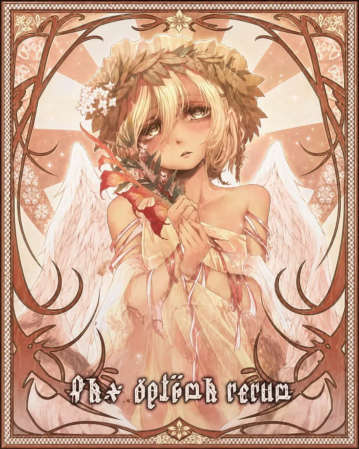

# 💫 Hi, I'm Kaezuria

High-school student learning **cybersecurity**, programming and game development. I build small projects to understand how things work, experiment with new technologies and have fun along the way. 💻🔐🎮

  
  
  

## 🌸 A little about me

- 🔐 Exploring cybersecurity and secure programming
- 🎮 Creating small games and interactive projects
- 📚 Learning by building, testing and breaking things safely
- 🌸 Anime and romance enjoyer
- 🚀 Aspiring cybersecurity engineer

## 🛠️ Tools and technologies

### Languages

   

### Platforms and creative tools

    

## 📊 GitHub activity

  
  

  

## 🌸 Anime corner

  

  <b>😈 Tanya the Evil 😈</b> 
  Military • Strategy • War

  

